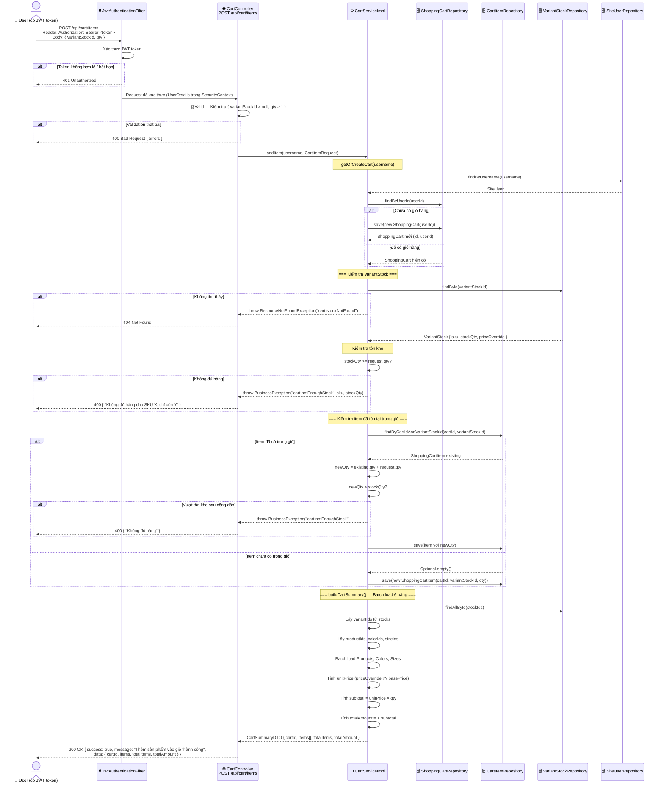

# 🛒 Use Case: Giỏ Hàng (Shopping Cart)

> Xem file `CART_USECASE.drawio` để import vào [draw.io](https://draw.io)

---

## 📌 Actors

| Actor | Mô tả |
|-------|--------|
| **User (Thành viên)** | Người dùng đã đăng nhập, có JWT token hợp lệ |
| **System** | Spring Boot Backend |
| **Database** | MySQL — các bảng: `shopping_cart`, `shopping_cart_item`, `variant_stock`, `product_variant`, `product`, `color`, `size` |

> ⚠️ **Tất cả Cart APIs đều yêu cầu JWT token** — không có token sẽ nhận `401 Unauthorized`

---

## 📋 Use Cases Tổng Quan

```
┌──────────────────────────────────────────────────────────────────────────┐
│                       <<System>> Giỏ Hàng                                │
│                                                                          │
│  User ──────►  UC1: Xem Giỏ Hàng          GET  /api/cart                │
│                                                                          │
│  User ──────►  UC2: Thêm Sản Phẩm         POST /api/cart/items          │
│                         ↳ <<include>> Kiểm Tra Tồn Kho                  │
│                         ↳ <<include>> Tạo/Lấy Giỏ Hàng                 │
│                         ↳ <<extend>>  Cộng Dồn Số Lượng (nếu đã có)    │
│                                                                          │
│  User ──────►  UC3: Cập Nhật Số Lượng     PUT  /api/cart/items/{id}     │
│                         ↳ <<include>> Kiểm Tra Tồn Kho                  │
│                                                                          │
│  User ──────►  UC4: Xóa Sản Phẩm          DELETE /api/cart/items/{id}   │
│                                                                          │
│  User ──────►  UC5: Làm Trống Giỏ         DELETE /api/cart              │
│                                                                          │
└──────────────────────────────────────────────────────────────────────────┘
```

---

## 🔄 UC2 — Thêm Sản Phẩm Vào Giỏ (Chi Tiết)



---

## 🔄 Flowchart Logic `addItem()`

```mermaid
flowchart TD
    A([Start: POST /api/cart/items]) --> B{JWT Token hợp lệ?}
    B -- Không --> C[401 Unauthorized]
    B -- Có --> D[@Valid: variantStockId, qty ≥ 1]
    D --> E{Validation OK?}
    E -- Không --> F[400 Bad Request]
    E -- Có --> G[getOrCreateCart username]
    G --> H{Giỏ hàng tồn tại?}
    H -- Có --> I[Lấy giỏ hàng hiện có]
    H -- Không --> J[Tạo ShoppingCart mới]
    I & J --> K[findById variantStockId]
    K --> L{VariantStock tồn tại?}
    L -- Không --> M[404: cart.stockNotFound]
    L -- Có --> N{stockQty >= request.qty?}
    N -- Không --> O[400: cart.notEnoughStock]
    N -- Có --> P{Item đã có trong giỏ?}
    P -- Có --> Q[newQty = existing.qty + request.qty]
    Q --> R{newQty > stockQty?}
    R -- Có --> S[400: cart.notEnoughStock]
    R -- Không --> T[update item.qty = newQty]
    P -- Chưa --> U[Tạo ShoppingCartItem mới]
    T & U --> V[buildCartSummary - Batch load 6 bảng]
    V --> W[Tính giá: priceOverride ?? basePrice]
    W --> X[Tính subtotal, totalAmount]
    X --> Y([200 OK: CartSummaryDTO])

    style A fill:#d5e8d4,stroke:#82b366
    style Y fill:#d5e8d4,stroke:#82b366
    style C fill:#f8cecc,stroke:#b85450
    style F fill:#f8cecc,stroke:#b85450
    style M fill:#f8cecc,stroke:#b85450
    style O fill:#f8cecc,stroke:#b85450
    style S fill:#f8cecc,stroke:#b85450
```

---

## 📊 Request / Response Format

### Request — Thêm vào giỏ

```
POST /api/cart/items
Authorization: Bearer <JWT_TOKEN>
Content-Type: application/json

{
  "variantStockId": 5,
  "qty": 2
}
```

### Response thành công

```json
{
  "success": true,
  "message": "Thêm sản phẩm vào giỏ thành công",
  "data": {
    "cartId": 1,
    "userId": 3,
    "items": [
      {
        "id": 10,
        "variantStockId": 5,
        "sku": "NIKE-RED-M",
        "productName": "Áo thun Nike",
        "colorName": "Đỏ",
        "colorHex": "#FF0000",
        "sizeLabel": "M",
        "qty": 2,
        "unitPrice": 250000,
        "subtotal": 500000,
        "availableStock": 10
      }
    ],
    "totalItems": 2,
    "totalAmount": 500000
  }
}
```

### Response lỗi — Không đủ hàng

```json
{
  "success": false,
  "message": "Không đủ hàng cho SKU NIKE-RED-M, chỉ còn 1",
  "data": null
}
```

---

## 🗺️ Bảng Dữ Liệu Liên Quan

```
POST /api/cart/items
         ↓
  shopping_cart_item (cartId, variantStockId, qty)
         ↓ join
  variant_stock (id, variantId, sizeId, stockQty, priceOverride, sku)
         ↓ join
  product_variant (id, productId, colorId, colorImageUrl)
         ↓ join                    ↓ join
  product (name, basePrice)    color (name, hexCode)
                                    ↓ join
                               size (label, type)
```

---

## 📋 Tất Cả Cart Endpoints

| Endpoint | Method | Mô tả | Request Body | Success |
|----------|--------|-------|-------------|---------|
| `/api/cart` | GET | Xem giỏ hàng | — | `200` CartSummaryDTO |
| `/api/cart/items` | POST | **Thêm sản phẩm** | `{ variantStockId, qty }` | `200` CartSummaryDTO |
| `/api/cart/items/{id}` | PUT | Cập nhật số lượng | `{ variantStockId, qty }` | `200` CartSummaryDTO |
| `/api/cart/items/{id}` | DELETE | Xóa 1 sản phẩm | — | `200` CartSummaryDTO |
| `/api/cart` | DELETE | Làm trống giỏ | — | `200` null |

> Tất cả đều cần header: `Authorization: Bearer <token>`

