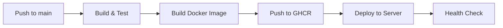

# CI/CD Setup for Clothing Store

## 📦 Files Created

### Docker Configuration
- `ec/Dockerfile` - Multi-stage Docker build configuration
- `ec/.dockerignore` - Files to exclude from Docker build
- `docker-compose.yml` - Local development with Docker Compose
- `.env.example` - Environment variables template

### GitHub Actions CI/CD
- `.github/workflows/ci-cd.yml` - Main CI/CD pipeline

### Documentation & Scripts
- `DEPLOYMENT_GUIDE.md` - Detailed deployment instructions
- `deploy.sh` - Manual deployment script (Linux/Mac)
- `run-local.ps1` - Local Docker build and run (Windows)

## 🚀 Quick Start

### 1. Setup GitHub Secrets

Go to your GitHub repository → Settings → Secrets → Actions, and add:

**Required Secrets:**
```
SERVER_HOST=your_server_ip
SERVER_USER=your_ssh_user
SSH_PRIVATE_KEY=your_private_ssh_key
DB_URL=jdbc:mysql://host:port/database
DB_USERNAME=your_db_user
DB_PASSWORD=your_db_password
JWT_SECRET=your_jwt_secret_key
```

### 2. Generate SSH Key

```bash
# Generate new SSH key
ssh-keygen -t rsa -b 4096 -f ~/.ssh/github_actions

# Copy public key to server
ssh-copy-id -i ~/.ssh/github_actions.pub user@server

# Copy private key content to GitHub Secret
cat ~/.ssh/github_actions
```

### 3. Prepare Server

```bash
# Install Docker
curl -fsSL https://get.docker.com | sh

# Create directories
mkdir -p /opt/clothing-store/{uploads,logs}

# Install MySQL (or use existing)
docker run -d \
  --name mysql-db \
  -p 3307:3306 \
  -e MYSQL_ROOT_PASSWORD=password \
  -e MYSQL_DATABASE=ecommerce \
  mysql:8.0
```

### 4. Deploy

Simply push to main branch:

```bash
git add .
git commit -m "deploy: initial deployment"
git push origin main
```

## 🔄 CI/CD Workflow



### Workflow Jobs

1. **Build & Test**: Compile Java code, run tests, create JAR
2. **Docker Build**: Build Docker image and push to GitHub Container Registry
3. **Deploy**: SSH to server, pull image, restart container

## 📝 Configuration Details

### Docker Image Features
- ✅ Multi-stage build (smaller image size)
- ✅ Java 21 runtime
- ✅ Non-root user for security
- ✅ Health check configured
- ✅ Optimized JVM settings

### Security Features
- ✅ Secrets management via GitHub Secrets
- ✅ SSH key authentication
- ✅ Private container registry
- ✅ Environment variable injection
- ✅ No hardcoded credentials

## 🧪 Local Testing

### Using Docker Compose

```bash
# Start all services
docker-compose up -d

# View logs
docker-compose logs -f app

# Stop services
docker-compose down
```

### Using PowerShell Script (Windows)

```powershell
# Build and run locally
.\run-local.ps1

# View logs
docker logs -f clothing-store-api

# Stop
docker stop clothing-store-api
```

### Using Bash Script (Linux/Mac)

```bash
# Build and deploy
chmod +x deploy.sh
./deploy.sh
```

## 📊 Monitoring

### Health Checks

```bash
# Application health
curl http://your-server:8080/actuator/health

# Container health
docker inspect clothing-store-api | grep Health -A 10
```

### View Logs

```bash
# Real-time logs
docker logs -f clothing-store-api

# Last 100 lines
docker logs clothing-store-api --tail 100

# Since 1 hour ago
docker logs clothing-store-api --since 1h
```

## 🔧 Troubleshooting

### Build Fails

```bash
# Check Maven build locally
cd ec
mvn clean package

# Check Docker build
docker build -t test ./ec
```

### Deployment Fails

```bash
# Check SSH connection
ssh -i ~/.ssh/github_actions user@server

# Check Docker on server
docker ps
docker images

# Check container logs
docker logs clothing-store-api
```

### Database Connection Issues

```bash
# Test DB connection
docker exec -it clothing-store-api sh
# Inside container:
nc -zv db_host 3307
```

## 🔄 Rollback Procedure

```bash
# SSH to server
ssh user@server

# List images
docker images | grep clothing-store-api

# Stop current container
docker stop clothing-store-api
docker rm clothing-store-api

# Run previous version
docker run -d --name clothing-store-api \
  [same env vars] \
  ghcr.io/username/clothing-store-api:previous-tag
```

## 📚 Additional Resources

- [DEPLOYMENT_GUIDE.md](DEPLOYMENT_GUIDE.md) - Detailed deployment guide
- [GitHub Actions Docs](https://docs.github.com/en/actions)
- [Docker Best Practices](https://docs.docker.com/develop/dev-best-practices/)

## ✅ Checklist

Before first deployment:

- [ ] GitHub Secrets configured
- [ ] SSH key generated and added to server
- [ ] Docker installed on server
- [ ] Database running and accessible
- [ ] Firewall configured (ports 8080, 3307, 22)
- [ ] Server directories created
- [ ] `.env` file created from `.env.example`

## 🆘 Support

If you encounter issues:

1. Check GitHub Actions logs
2. Check server logs: `docker logs clothing-store-api`
3. Verify secrets are correctly set
4. Test SSH connection manually
5. Check server resources: `docker stats`

## 📈 Next Steps

- [ ] Add SSL/TLS with Let's Encrypt
- [ ] Setup Nginx reverse proxy
- [ ] Add monitoring (Prometheus/Grafana)
- [ ] Add log aggregation (ELK Stack)
- [ ] Setup backup automation
- [ ] Add staging environment

