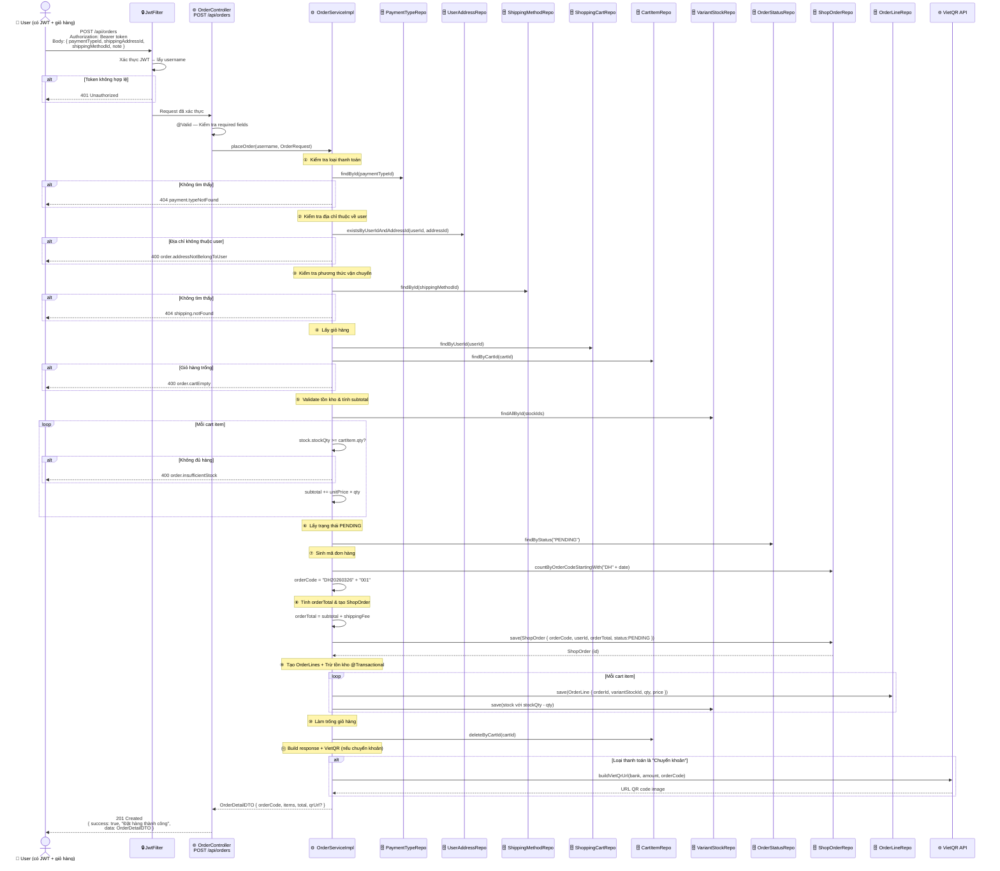
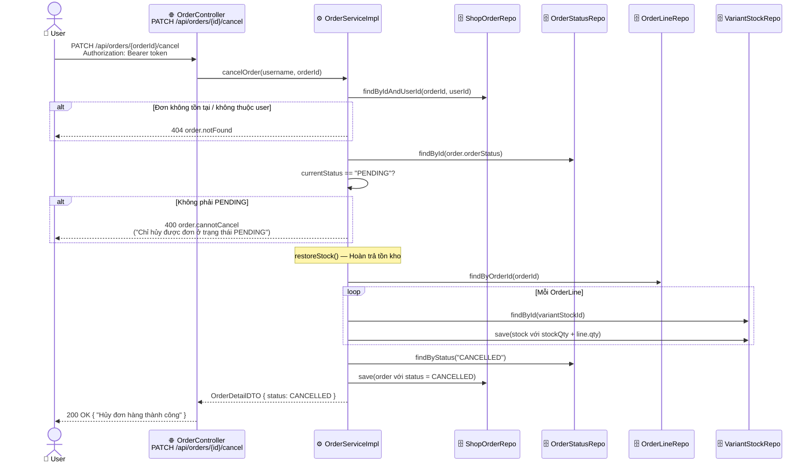

# 🧾 Use Case: Đặt Hàng & Thanh Toán (Order & Payment)

> Xem file `ORDER_USECASE.drawio` để import vào [draw.io](https://draw.io)

---

## 📌 Actors

| Actor | Mô tả |
|-------|--------|
| **User** | Đã đăng nhập, có JWT token, có items trong giỏ |
| **Admin** | Quản trị viên, quản lý và cập nhật trạng thái đơn |
| **System** | Spring Boot Backend |
| **VietQR** | Dịch vụ tạo QR chuyển khoản (`img.vietqr.io`) |
| **Database** | MySQL — 15+ bảng liên quan |

---

## 📋 Use Cases Tổng Quan

```
┌──────────────────────────────────────────────────────────────────────────┐
│                    <<System>> Đặt Hàng & Thanh Toán                      │
│                                                                          │
│  User  ──────► UC1: Đặt Hàng (Place Order)   POST /api/orders           │
│                    ↳ <<include>> Kiểm tra địa chỉ, phương thức          │
│                    ↳ <<include>> Kiểm tra tồn kho toàn bộ cart          │
│                    ↳ <<include>> Tính tổng tiền                          │
│                    ↳ <<include>> Tạo OrderLines + Trừ tồn kho           │
│                    ↳ <<include>> Xóa giỏ hàng                           │
│                    ↳ <<extend>>  Tạo VietQR URL (nếu chuyển khoản)      │
│                                                                          │
│  User  ──────► UC2: Xem Lịch Sử Đơn Hàng     GET  /api/orders          │
│                                                                          │
│  User  ──────► UC3: Xem Chi Tiết Đơn           GET  /api/orders/{id}    │
│                                                                          │
│  User  ──────► UC4: Hủy Đơn Hàng              PATCH /api/orders/{id}/cancel │
│                    ↳ <<include>> Hoàn trả tồn kho                       │
│                    ↳ [chỉ được hủy khi PENDING]                         │
│                                                                          │
│  Admin ──────► UC5: Xem Tất Cả Đơn             GET  /api/orders/admin/all│
│  Admin ──────► UC6: Cập Nhật Trạng Thái        PATCH /api/orders/{id}/status│
│                                                                          │
└──────────────────────────────────────────────────────────────────────────┘
```

---

## 🔄 UC1 — Đặt Hàng (Sequence Chi Tiết)



---

## 🔄 UC4 — Hủy Đơn Hàng (Sequence)



---

## 🔄 Flowchart `placeOrder()`

```mermaid
flowchart TD
    A([▶ Start: POST /api/orders]) --> B{JWT hợp lệ?}
    B -- Không --> C[❌ 401 Unauthorized]
    B -- Có --> D[@Valid: paymentTypeId, shippingAddressId, shippingMethodId]
    D --> E{Validation OK?}
    E -- Không --> F[❌ 400 Bad Request]
    E -- Có --> G[Kiểm tra PaymentType tồn tại]
    G --> H{Found?}
    H -- Không --> I[❌ 404 payment.typeNotFound]
    H -- Có --> J[Kiểm tra Address thuộc user]
    J --> K{OK?}
    K -- Không --> L[❌ 400 order.addressNotBelongToUser]
    K -- Có --> M[Kiểm tra ShippingMethod tồn tại]
    M --> N{Found?}
    N -- Không --> O[❌ 404 shipping.notFound]
    N -- Có --> P[Lấy giỏ hàng + cartItems]
    P --> Q{Giỏ hàng trống?}
    Q -- Có --> R[❌ 400 order.cartEmpty]
    Q -- Không --> S[Kiểm tra tồn kho TẤT CẢ items]
    S --> T{Tất cả đủ hàng?}
    T -- Không --> U[❌ 400 order.insufficientStock]
    T -- Có --> V[Tính subtotal + shippingFee = orderTotal]
    V --> W[Lấy trạng thái PENDING]
    W --> X[Sinh mã đơn: DH + yyyyMMdd + 3 số]
    X --> Y[save ShopOrder]
    Y --> Z[Loop: save OrderLine + stock.qty -= qty]
    Z --> AA[deleteByCartId — Xóa giỏ hàng]
    AA --> AB{Thanh toán = Chuyển khoản?}
    AB -- Có --> AC[Tạo VietQR URL]
    AC --> AD([✅ 201 Created: OrderDetailDTO + qrUrl])
    AB -- Không --> AD

    style A fill:#d5e8d4,stroke:#82b366
    style AD fill:#d5e8d4,stroke:#82b366
    style C fill:#f8cecc,stroke:#b85450
    style F fill:#f8cecc,stroke:#b85450
    style I fill:#f8cecc,stroke:#b85450
    style L fill:#f8cecc,stroke:#b85450
    style O fill:#f8cecc,stroke:#b85450
    style R fill:#f8cecc,stroke:#b85450
    style U fill:#f8cecc,stroke:#b85450
```

---

## 💳 Luồng Thanh Toán Theo Loại

### COD (Tiền Mặt Khi Nhận Hàng)
```
Đặt hàng → PENDING → PROCESSING → SHIPPING → COMPLETED
                                              ↑ Xác nhận nhận hàng
```

### Bank Transfer (Chuyển Khoản)
```
Đặt hàng → PENDING + QR Code URL
    ↓
User quét QR → Chuyển khoản với nội dung "DH20260326001"
    ↓
Admin xác nhận → PROCESSING → SHIPPING → COMPLETED
```

### VietQR URL Format
```
https://img.vietqr.io/image/{bankId}-{accountNumber}-compact2.png
    ?amount={orderTotal}
    &addInfo={orderCode}            ← nội dung chuyển khoản
    &accountName={holderName}
```

---

## 📊 Order Status Flow

```
PENDING → PROCESSING → SHIPPING → COMPLETED
   ↓
CANCELLED  (chỉ từ PENDING, user hoặc admin)
```

| Status | Mô tả | Ai thay đổi |
|--------|--------|-------------|
| `PENDING` | Vừa đặt hàng, chờ xác nhận | Hệ thống tự set |
| `PROCESSING` | Đang xử lý / đã xác nhận thanh toán | Admin |
| `SHIPPING` | Đang giao hàng | Admin |
| `COMPLETED` | Đã nhận hàng thành công | Admin |
| `CANCELLED` | Đã hủy (tồn kho được hoàn trả) | User (chỉ PENDING) / Admin |

---

## 📦 Request / Response

### Request — Đặt hàng
```
POST /api/orders
Authorization: Bearer <JWT_TOKEN>
Content-Type: application/json

{
  "paymentTypeId": 2,
  "shippingAddressId": 1,
  "shippingMethodId": 1,
  "note": "Giao giờ hành chính"
}
```

### Response thành công — COD
```json
{
  "success": true,
  "message": "Đặt hàng thành công",
  "data": {
    "id": 5,
    "orderCode": "DH20260326001",
    "orderDate": "2026-03-26T10:30:00",
    "statusName": "PENDING",
    "paymentTypeName": "COD",
    "shippingMethodName": "Giao hàng tiêu chuẩn",
    "shippingFee": 30000,
    "subtotal": 500000,
    "orderTotal": 530000,
    "qrUrl": null,
    "bankInfo": null,
    "items": [...]
  }
}
```

### Response thành công — Chuyển khoản
```json
{
  "success": true,
  "message": "Đặt hàng thành công",
  "data": {
    "orderCode": "DH20260326002",
    "orderTotal": 530000,
    "qrUrl": "https://img.vietqr.io/image/MB-0123456789-compact2.png?amount=530000&addInfo=DH20260326002&accountName=SHOP",
    "bankInfo": {
      "bankName": "MB Bank",
      "accountNumber": "0123456789",
      "accountHolderName": "CLOTHING STORE"
    }
  }
}
```

---

## 📋 Tất Cả Order Endpoints

| Endpoint | Method | Auth | Mô tả |
|----------|--------|------|-------|
| `/api/orders` | POST | ✅ User | Đặt hàng từ giỏ |
| `/api/orders` | GET | ✅ User | Lịch sử đơn hàng của tôi |
| `/api/orders/{id}` | GET | ✅ User | Chi tiết 1 đơn |
| `/api/orders/{id}/cancel` | PATCH | ✅ User | Hủy đơn (chỉ PENDING) |
| `/api/orders/admin/all` | GET | 🔐 ADMIN | Tất cả đơn hàng (phân trang) |
| `/api/orders/admin/{id}` | GET | 🔐 ADMIN | Chi tiết đơn bất kỳ |
| `/api/orders/admin/by-status/{statusId}` | GET | 🔐 ADMIN | Lọc theo trạng thái |
| `/api/orders/{id}/status` | PATCH | 🔐 ADMIN | Cập nhật trạng thái |

