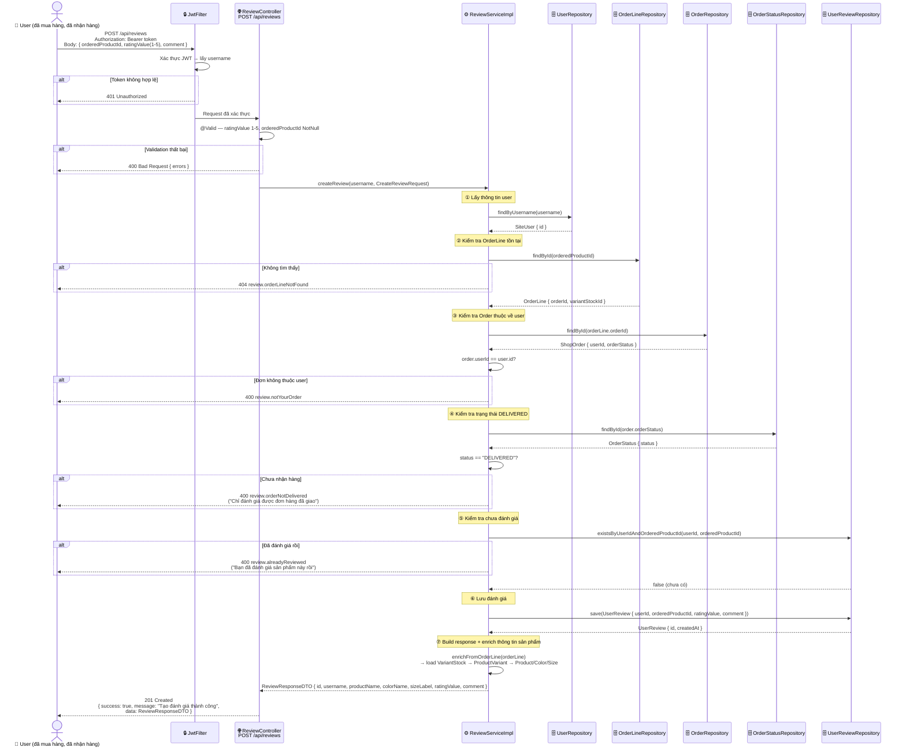

# ⭐ Use Case: Đánh Giá Sản Phẩm (Product Review)

> Xem file `REVIEW_USECASE.drawio` để import vào [draw.io](https://draw.io)

---

## 📌 Actors & Điều Kiện Quan Trọng

| Actor | Mô tả |
|-------|--------|
| **Guest** | Xem đánh giá, xem thống kê — không cần đăng nhập |
| **User** | Tạo / xem / xóa đánh giá — cần JWT token |
| **System** | Spring Boot Backend |

> ⚠️ **Ràng buộc nghiệp vụ khi tạo đánh giá:**
> 1. `orderedProductId` phải là ID của `order_line` hợp lệ
> 2. `order_line` đó phải thuộc đơn hàng của **chính user đó**
> 3. Đơn hàng phải ở trạng thái **DELIVERED**
> 4. Mỗi `order_line` chỉ được đánh giá **1 lần duy nhất**
> 5. `ratingValue` từ **1 đến 5** sao

---

## 📋 Use Cases Tổng Quan

```
┌───────────────────────────────────────────────────────────────────────┐
│                   <<System>> Đánh Giá Sản Phẩm                        │
│                                                                       │
│  Guest ──────► UC1: Xem Đánh Giá Theo Sản Phẩm                       │
│                      GET /api/reviews/product/{productId}             │
│                                                                       │
│  Guest ──────► UC2: Xem Thống Kê Đánh Giá                           │
│                      GET /api/reviews/product/{productId}/summary     │
│                                                                       │
│  User  ──────► UC3: Tạo Đánh Giá                                     │
│                      POST /api/reviews                                │
│                      ↳ <<include>> Kiểm tra OrderLine hợp lệ         │
│                      ↳ <<include>> Kiểm tra đơn hàng là DELIVERED    │
│                      ↳ <<include>> Kiểm tra chưa đánh giá lần nào   │
│                                                                       │
│  User  ──────► UC4: Xem Đánh Giá Của Tôi                            │
│                      GET /api/reviews/my                              │
│                                                                       │
│  User  ──────► UC5: Xóa Đánh Giá                                     │
│                      DELETE /api/reviews/{id}                         │
│                                                                       │
└───────────────────────────────────────────────────────────────────────┘
```

---

## 🔄 UC3 — Tạo Đánh Giá (Sequence Chi Tiết)



---

## 🔄 Flowchart `createReview()`

```mermaid
flowchart TD
    A([▶ POST /api/reviews]) --> B{JWT hợp lệ?}
    B -- Không --> C[❌ 401 Unauthorized]
    B -- Có --> D[@Valid: orderedProductId, ratingValue 1-5]
    D --> E{Validation OK?}
    E -- Không --> F[❌ 400 Bad Request]
    E -- Có --> G[findById orderedProductId\northerwise order_line]
    G --> H{OrderLine\ntồn tại?}
    H -- Không --> I[❌ 404 review.orderLineNotFound]
    H -- Có --> J[findById order_line.orderId]
    J --> K{Order thuộc\nuser này?}
    K -- Không --> L[❌ 400 review.notYourOrder]
    K -- Có --> M[Lấy OrderStatus]
    M --> N{status ==\nDELIVERED?}
    N -- Không --> O[❌ 400 review.orderNotDelivered]
    N -- Có --> P[existsByUserIdAndOrderedProductId]
    P --> Q{Đã đánh giá\nrồi?}
    Q -- Có --> R[❌ 400 review.alreadyReviewed]
    Q -- Không --> S[save UserReview]
    S --> T[enrichFromOrderLine\n→ load Product/Color/Size]
    T --> U([✅ 201 Created: ReviewResponseDTO])

    style A fill:#d5e8d4,stroke:#82b366
    style U fill:#d5e8d4,stroke:#82b366
    style C fill:#f8cecc,stroke:#b85450
    style F fill:#f8cecc,stroke:#b85450
    style I fill:#f8cecc,stroke:#b85450
    style L fill:#f8cecc,stroke:#b85450
    style O fill:#f8cecc,stroke:#b85450
    style R fill:#f8cecc,stroke:#b85450
```

---

## 📊 Request / Response

### UC3 — Tạo đánh giá
```
POST /api/reviews
Authorization: Bearer <JWT_TOKEN>
Content-Type: application/json

{
  "orderedProductId": 12,
  "ratingValue": 5,
  "comment": "Sản phẩm rất đẹp, chất lượng tốt!"
}
```

### Response thành công
```json
{
  "success": true,
  "message": "Tạo đánh giá thành công",
  "data": {
    "id": 3,
    "userId": 7,
    "username": "nguyen_loc",
    "orderedProductId": 12,
    "ratingValue": 5,
    "comment": "Sản phẩm rất đẹp, chất lượng tốt!",
    "createdAt": "2026-03-26T14:00:00",
    "productId": 2,
    "productName": "Áo thun Nike",
    "productSlug": "ao-thun-nike",
    "colorName": "Đỏ",
    "colorHex": "#FF0000",
    "sizeLabel": "M",
    "sku": "NIKE-RED-M"
  }
}
```

### UC2 — Thống kê đánh giá
```json
{
  "success": true,
  "data": {
    "productId": 2,
    "avgRating": 4.5,
    "totalReviews": 18
  }
}
```

---

## 🗺️ Quan Hệ Bảng Dữ Liệu

```
user_review
  ├─ userId      → site_users.id
  ├─ orderedProductId → order_line.id
  │       ├─ orderId          → shop_order.id  (kiểm tra DELIVERED + thuộc user)
  │       └─ variantStockId   → variant_stock.id
  │               └─ variantId → product_variant.id
  │                       ├─ productId → products (tên, slug)
  │                       └─ colorId   → colors (tên, hex)
  │               └─ sizeId   → sizes (label, type)
  ├─ ratingValue  (1–5)
  └─ comment      (max 2000 ký tự)
```

---

## 📋 Tất Cả Review Endpoints

| Endpoint | Method | Auth | Mô tả |
|----------|--------|------|-------|
| `/api/reviews/product/{productId}` | GET | ❌ Public | Xem tất cả đánh giá của sản phẩm |
| `/api/reviews/product/{productId}/summary` | GET | ❌ Public | Thống kê: avg, tổng số đánh giá |
| `/api/reviews` | POST | ✅ User | **Tạo đánh giá** (cần DELIVERED) |
| `/api/reviews/my` | GET | ✅ User | Danh sách đánh giá của tôi |
| `/api/reviews/{id}` | DELETE | ✅ User | Xóa đánh giá của mình |

