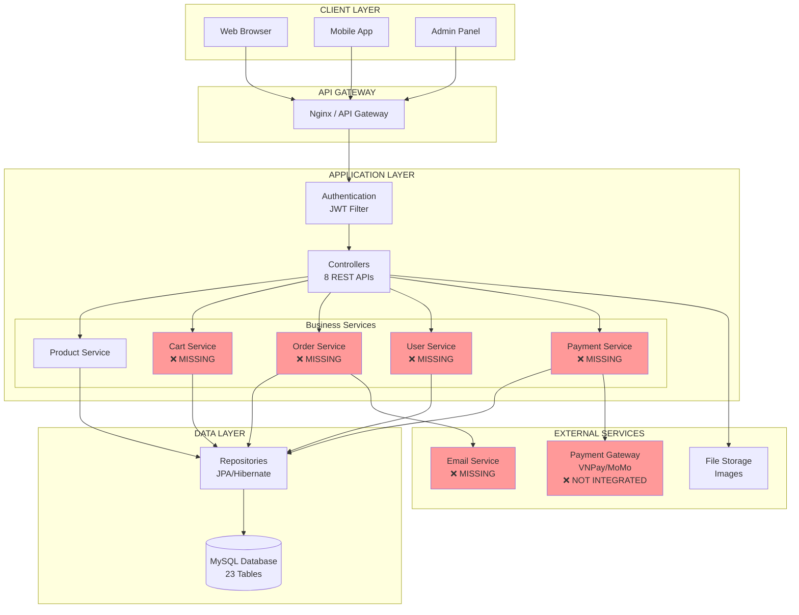
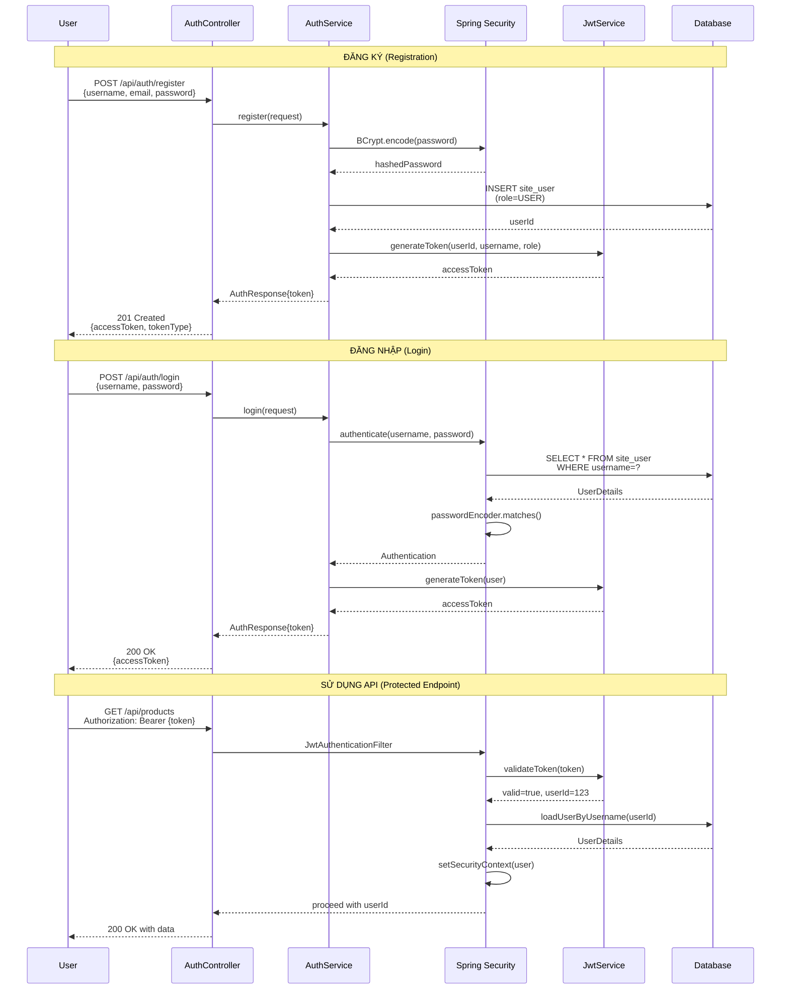
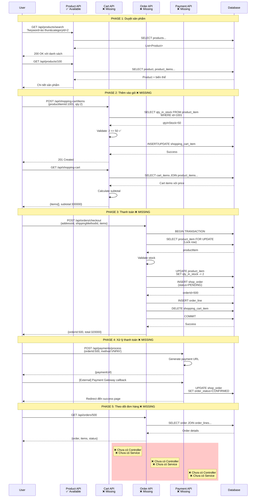
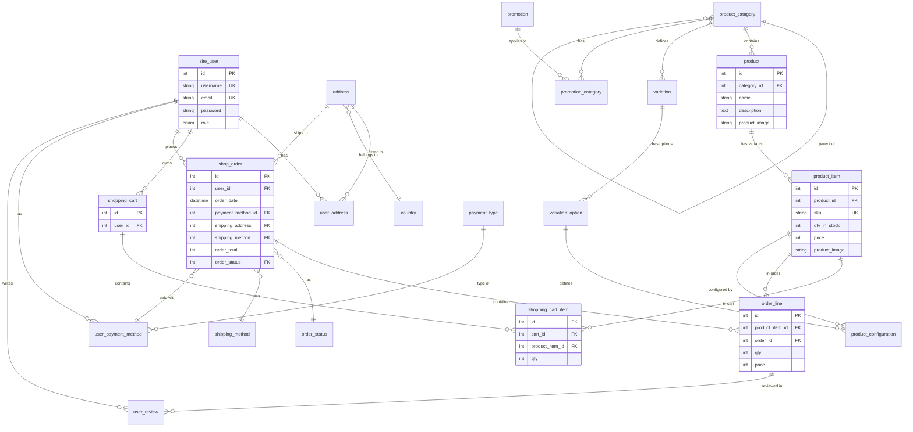
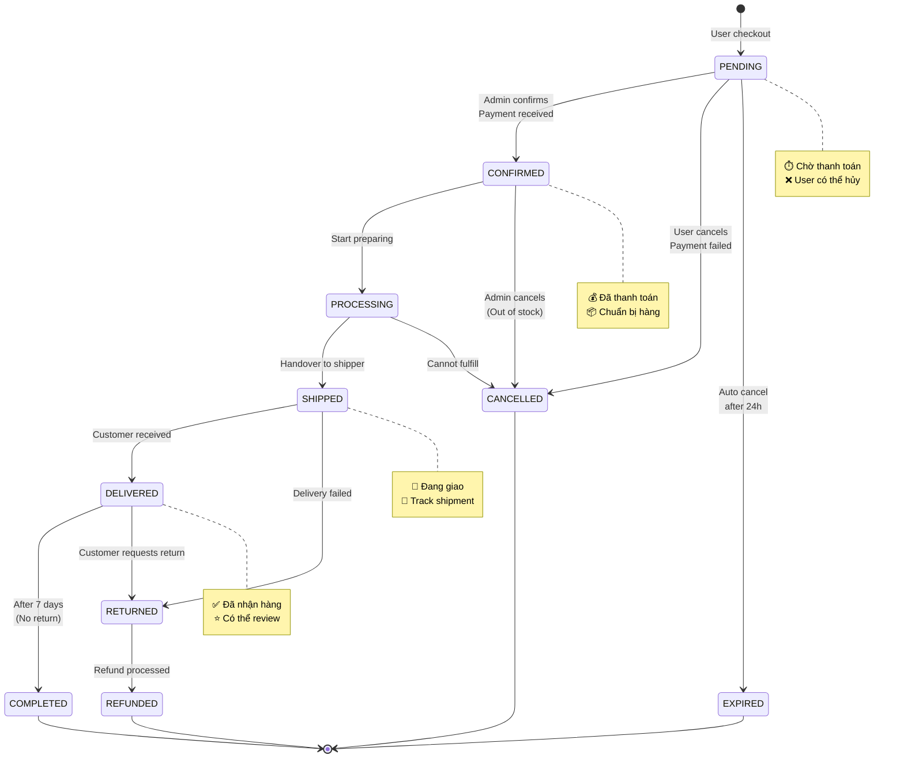
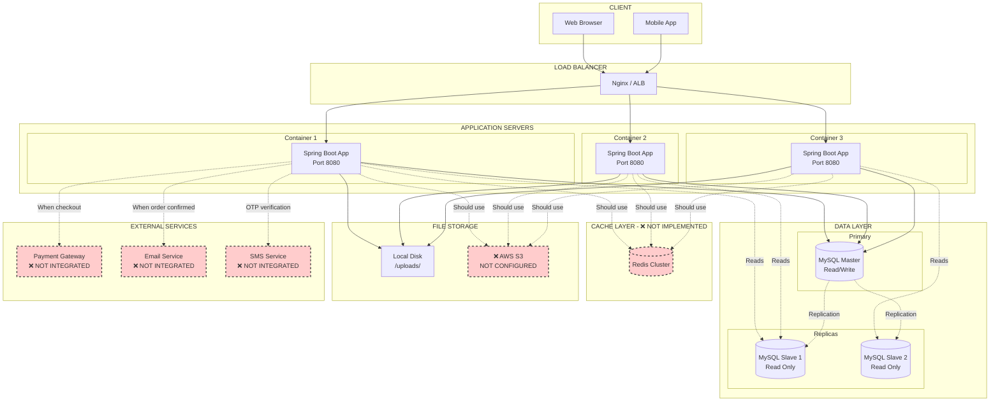
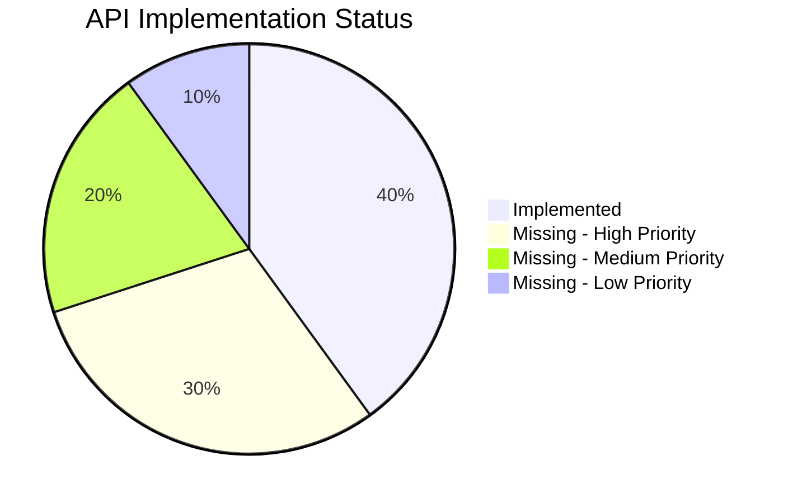

# 🎨 SƠ ĐỒ LUỒNG HỆ THỐNG - CLOTHING STORE

> Các sơ đồ trực quan hóa luồng hoạt động của hệ thống

---

## 📊 SƠ ĐỒ TỔNG QUAN KIẾN TRÚC



---

## 🔐 LUỒNG AUTHENTICATION



---

## 🛍️ LUỒNG TẠO SẢN PHẨM (Product Creation Flow)

```mermaid
graph TD
    START([Bắt đầu tạo sản phẩm]) --> AUTH{Đã đăng nhập?}
    AUTH -->|No| LOGIN[POST /api/auth/login]
    LOGIN --> AUTH
    AUTH -->|Yes, JWT valid| STEP1

    STEP1[1️⃣ Tạo Category<br/>POST /api/product-categories<br/>{categoryName, parentCategoryId}]
    STEP1 --> CHECK1{Category<br/>tồn tại?}
    CHECK1 -->|No| STEP1
    CHECK1 -->|Yes| STEP2

    STEP2[2️⃣ Tạo Variation<br/>POST /api/variations<br/>{name, categoryId}]
    STEP2 --> STEP3

    STEP3[3️⃣ Tạo Variation Options<br/>POST /api/variation-options<br/>{variationId, value}<br/>Lặp nhiều lần]
    STEP3 --> STEP4

    STEP4[4️⃣ Upload ảnh sản phẩm<br/>POST /api/files/upload<br/>Multipart file]
    STEP4 --> IMG_URL[Nhận URL: /uploads/images/xxx.jpg]
    IMG_URL --> STEP5

    STEP5[5️⃣ Tạo Product<br/>POST /api/products<br/>{name, categoryId, description, productImage}]
    STEP5 --> CHECK5{Validation<br/>OK?}
    CHECK5 -->|categoryId không tồn tại| ERROR1[❌ 404 Not Found]
    CHECK5 -->|OK| STEP6

    STEP6[6️⃣ Tạo Product Item<br/>POST /api/product-items<br/>{productId, sku, price, qtyInStock}]
    STEP6 --> LOOP{Có nhiều<br/>biến thể?}
    LOOP -->|Yes| STEP6
    LOOP -->|No| STEP7

    STEP7[7️⃣ Gắn Configuration<br/>POST /api/product-configurations<br/>{productItemId, variationOptionId}]
    STEP7 --> LOOP2{Mỗi item<br/>có nhiều options?}
    LOOP2 -->|Yes| STEP7
    LOOP2 -->|No| DONE

    DONE([✅ Sản phẩm hoàn chỉnh])

    style AUTH fill:#87CEEB
    style CHECK1 fill:#FFD700
    style CHECK5 fill:#FFD700
    style ERROR1 fill:#FF6B6B
    style DONE fill:#90EE90
```

---

## 🛒 LUỒNG MUA HÀNG (E-commerce Flow) - ⚠️ CHƯA TRIỂN KHAI



---

## 🗄️ SƠ ĐỒ DATABASE RELATIONSHIPS



---

## 📦 SƠ ĐỒ DATA FLOW - PRODUCT MANAGEMENT

```mermaid
graph LR
    subgraph "INPUT"
        ADMIN[Admin User]
        DATA[Product Data<br/>JSON]
        IMAGE[Image Files<br/>JPG/PNG]
    end

    subgraph "API LAYER"
        AUTH_FILTER[JWT Filter<br/>Validate Token]
        CTRL[ProductController<br/>@PostMapping]
        VALID[Bean Validation<br/>@Valid]
    end

    subgraph "BUSINESS LAYER"
        SVC[ProductServiceImpl]
        
        subgraph "Validations"
            V1[Check categoryId exists]
            V2[Check SKU unique]
            V3[Check price > 0]
        end
        
        MAPPER[Entity ↔ DTO<br/>BeanUtils.copy]
    end

    subgraph "DATA LAYER"
        REPO[ProductRepository<br/>JpaRepository]
        CACHE[❌ Cache<br/>Redis]
        DB[(MySQL)]
    end

    subgraph "OUTPUT"
        RESPONSE[ApiResponse<br/>{success, data, message}]
        STORAGE[File System<br/>/uploads/images/]
    end

    ADMIN --> DATA
    ADMIN --> IMAGE
    
    DATA --> AUTH_FILTER
    IMAGE --> AUTH_FILTER
    
    AUTH_FILTER --> CTRL
    CTRL --> VALID
    VALID --> SVC
    
    SVC --> V1
    SVC --> V2
    SVC --> V3
    
    V1 --> MAPPER
    V2 --> MAPPER
    V3 --> MAPPER
    
    MAPPER --> REPO
    REPO --> CACHE
    CACHE -.->|Not implemented| DB
    REPO --> DB
    
    DB --> REPO
    REPO --> MAPPER
    MAPPER --> RESPONSE
    
    IMAGE --> STORAGE
    STORAGE --> RESPONSE
    
    RESPONSE --> ADMIN

    style CACHE fill:#ff9999,stroke:#333,stroke-width:2px,stroke-dasharray: 5 5
```

---

## 🔄 STATE DIAGRAM - ORDER STATUS



---

## 🏗️ COMPONENT DIAGRAM - BACKEND STRUCTURE

```mermaid
graph TB
    subgraph "com.utc.ec"
        APP[EcApplication.java<br/>@SpringBootApplication]
        
        subgraph "config"
            SEC[SecurityConfig]
            JWT_FILTER[JwtAuthenticationFilter]
            SWAGGER[SwaggerConfig]
            EXCEPTION[GlobalExceptionHandler]
        end
        
        subgraph "controller - 8 controllers"
            AUTH_CTRL[AuthController<br/>✅ /api/auth/*]
            PROD_CTRL[ProductController<br/>✅ /api/products/*]
            ITEM_CTRL[ProductItemController<br/>✅ /api/product-items/*]
            CAT_CTRL[ProductCategoryController<br/>✅ /api/product-categories/*]
            VAR_CTRL[VariationController<br/>✅ /api/variations/*]
            OPT_CTRL[VariationOptionController<br/>✅ /api/variation-options/*]
            CONF_CTRL[ProductConfigurationController<br/>✅ /api/product-configurations/*]
            FILE_CTRL[FileUploadController<br/>✅ /api/files/*]
            
            CART_CTRL[❌ ShoppingCartController<br/>MISSING]
            ORDER_CTRL[❌ OrderController<br/>MISSING]
            USER_CTRL[❌ UserController<br/>MISSING]
        end
        
        subgraph "service + impl"
            AUTH_SVC[AuthService<br/>Login/Register/JWT]
            PROD_SVC[ProductService<br/>CRUD + Search]
            CAT_SVC[CategoryService<br/>Tree structure]
            VAR_SVC[VariationService]
            FILE_SVC[FileStorageService]
            
            CART_SVC[❌ CartService<br/>MISSING]
            ORDER_SVC[❌ OrderService<br/>MISSING]
        end
        
        subgraph "repository - 21 repos"
            REPO[JpaRepository<br/>Spring Data JPA]
            PROD_REPO[ProductRepository]
            USER_REPO[SiteUserRepository]
            ORDER_REPO[ShopOrderRepository]
            CART_REPO[ShoppingCartRepository]
        end
        
        subgraph "entity - 23 entities"
            ENT[JPA Entities<br/>@Entity @Table]
            USER_ENT[SiteUser]
            PROD_ENT[Product]
            ITEM_ENT[ProductItem]
            ORDER_ENT[ShopOrder]
        end
        
        subgraph "dto - 25 DTOs"
            DTO[Data Transfer Objects]
            API_RESP[ApiResponse<T>]
            PAGED_RESP[PagedResponse<T>]
        end
        
        subgraph "exception"
            EX1[ResourceNotFoundException]
            EX2[BusinessException]
        end
    end
    
    APP --> SEC
    APP --> SWAGGER
    
    SEC --> JWT_FILTER
    
    AUTH_CTRL --> AUTH_SVC
    PROD_CTRL --> PROD_SVC
    CAT_CTRL --> CAT_SVC
    VAR_CTRL --> VAR_SVC
    FILE_CTRL --> FILE_SVC
    
    CART_CTRL -.->|Not implemented| CART_SVC
    ORDER_CTRL -.->|Not implemented| ORDER_SVC
    USER_CTRL -.->|Not implemented| AUTH_SVC
    
    AUTH_SVC --> USER_REPO
    PROD_SVC --> PROD_REPO
    ORDER_SVC -.-> ORDER_REPO
    CART_SVC -.-> CART_REPO
    
    PROD_REPO --> PROD_ENT
    USER_REPO --> USER_ENT
    ORDER_REPO --> ORDER_ENT
    
    PROD_CTRL --> API_RESP
    PROD_SVC --> PAGED_RESP
    
    PROD_SVC --> EX1
    PROD_SVC --> EX2
    EXCEPTION --> EX1
    EXCEPTION --> EX2

    style CART_CTRL fill:#ffcccc
    style ORDER_CTRL fill:#ffcccc
    style USER_CTRL fill:#ffcccc
    style CART_SVC fill:#ffcccc
    style ORDER_SVC fill:#ffcccc
```

---

## 🎯 DEPLOYMENT DIAGRAM



---

## 📱 USE CASE DIAGRAM

```mermaid
graph TB
    subgraph ACTORS
        GUEST[Guest<br/>Khách vãng lai]
        USER[Registered User<br/>Khách hàng]
        ADMIN[Admin<br/>Quản trị viên]
    end

    subgraph "PUBLIC USE CASES"
        UC1[Browse Products<br/>✅ Implemented]
        UC2[Search Products<br/>✅ Implemented]
        UC3[View Product Details<br/>✅ Implemented]
        UC4[Register Account<br/>✅ Implemented]
        UC5[Login<br/>✅ Implemented]
    end

    subgraph "USER USE CASES"
        UC6[Add to Cart<br/>❌ Missing]
        UC7[View Cart<br/>❌ Missing]
        UC8[Checkout<br/>❌ Missing]
        UC9[Make Payment<br/>❌ Missing]
        UC10[View Orders<br/>❌ Missing]
        UC11[Cancel Order<br/>❌ Missing]
        UC12[Write Review<br/>❌ Missing]
        UC13[Manage Addresses<br/>❌ Missing]
        UC14[Update Profile<br/>❌ Missing]
    end

    subgraph "ADMIN USE CASES"
        UC15[Manage Products<br/>✅ Implemented]
        UC16[Manage Categories<br/>✅ Implemented]
        UC17[Manage Variations<br/>✅ Implemented]
        UC18[Upload Images<br/>✅ Implemented]
        UC19[Manage Orders<br/>❌ Missing]
        UC20[Update Order Status<br/>❌ Missing]
        UC21[Manage Promotions<br/>❌ Missing]
        UC22[View Analytics<br/>❌ Missing]
        UC23[Manage Users<br/>❌ Missing]
        UC24[Manage Inventory<br/>❌ Missing]
    end

    GUEST --> UC1
    GUEST --> UC2
    GUEST --> UC3
    GUEST --> UC4
    GUEST --> UC5

    USER --> UC1
    USER --> UC2
    USER --> UC3
    USER --> UC6
    USER --> UC7
    USER --> UC8
    USER --> UC9
    USER --> UC10
    USER --> UC11
    USER --> UC12
    USER --> UC13
    USER --> UC14

    ADMIN --> UC15
    ADMIN --> UC16
    ADMIN --> UC17
    ADMIN --> UC18
    ADMIN --> UC19
    ADMIN --> UC20
    ADMIN --> UC21
    ADMIN --> UC22
    ADMIN --> UC23
    ADMIN --> UC24

    style UC1 fill:#90EE90
    style UC2 fill:#90EE90
    style UC3 fill:#90EE90
    style UC4 fill:#90EE90
    style UC5 fill:#90EE90
    style UC15 fill:#90EE90
    style UC16 fill:#90EE90
    style UC17 fill:#90EE90
    style UC18 fill:#90EE90

    style UC6 fill:#FF6B6B
    style UC7 fill:#FF6B6B
    style UC8 fill:#FF6B6B
    style UC9 fill:#FF6B6B
    style UC10 fill:#FF6B6B
    style UC11 fill:#FF6B6B
    style UC12 fill:#FF6B6B
    style UC13 fill:#FF6B6B
    style UC14 fill:#FF6B6B
    style UC19 fill:#FF6B6B
    style UC20 fill:#FF6B6B
    style UC21 fill:#FF6B6B
    style UC22 fill:#FF6B6B
    style UC23 fill:#FF6B6B
    style UC24 fill:#FF6B6B
```



---

## ✅ API COVERAGE MAP



---

**Legend:**
- ✅ Implemented (Green)
- ❌ Missing (Red)
- ⚠️ Partial (Yellow)

**Tài liệu này được tạo bởi GitHub Copilot - March 17, 2026**

